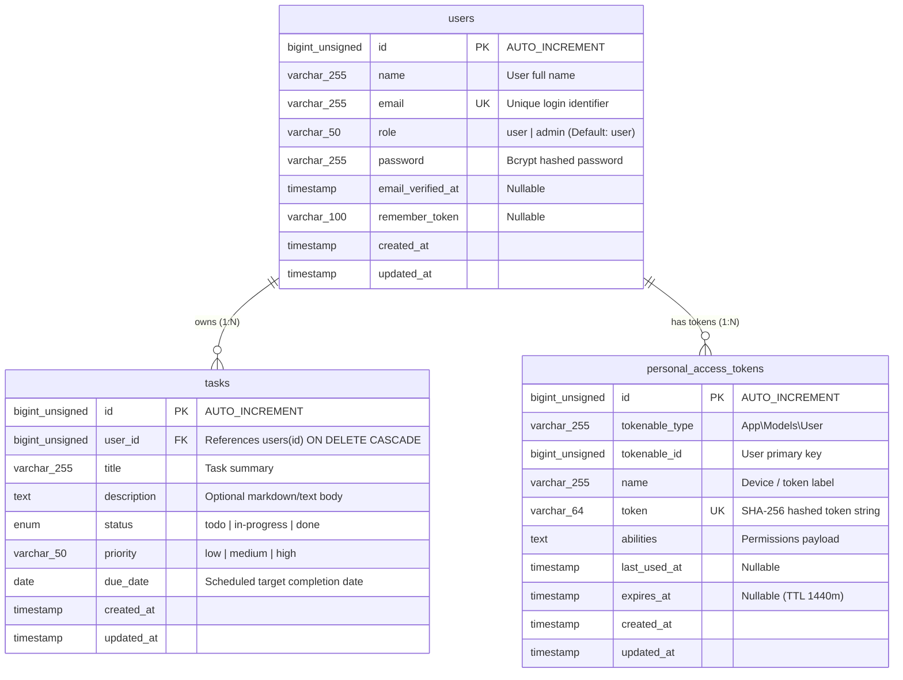

# Task 3: Database Design & Query Optimization Report
**Practical Assessment:** PHP / MySQL / React Developer  
**Candidate Name:** Sumant  
**Database System:** MySQL 8.0+ / InnoDB Engine  
**Associated DDL:** [`schema.sql`](./schema.sql)  

---

## 1. Relational Schema & Entity-Relationship Diagram (ERD)

The database schema is designed in **Third Normal Form (3NF)** with strict referential integrity, foreign key cascading, and optimized composite B-Tree indexes.



---

## 2. Indexing Strategy & Technical Justification

Every index in the `tasks` and `users` tables was chosen to support specific high-frequency queries in Tasks 1 and 2:

| Index Name | Table | Columns | Type | Purpose & Justification |
| :--- | :--- | :--- | :--- | :--- |
| `PRIMARY` | `users` | `id` | Primary Key | Clustered index for instant $O(1)$ lookups and foreign key parent targets. |
| `users_email_unique` | `users` | `email` | Unique B-Tree | Enforces uniqueness constraint and ensures $O(\log N)$ point lookups on login (`POST /api/login`). |
| `PRIMARY` | `tasks` | `id` | Primary Key | Clustered index identifying unique task records. |
| `tasks_user_id_foreign` | `tasks` | `user_id` | Foreign Key Index | Enables foreign key constraints and prevents table locks during `ON DELETE CASCADE` when deleting users. |
| `tasks_user_id_status_index` | `tasks` | `(user_id, status)` | **Composite B-Tree** | **Most critical query index:** Serves regular users filtering their tasks by status (`WHERE user_id = ? AND status = ?`). Satisfies the **Leftmost Prefix Rule**. |
| `tasks_status_index` | `tasks` | `status` | Single-Column | Serves the Admin dashboard filtering all global tasks by status (`WHERE status = 'todo'`) across all users. |
| `tasks_due_date_index` | `tasks` | `due_date` | Single-Column | Enables efficient date range filters (`due_date <= ?`) and calendar sorting without requiring filesorts. |

### Why the Composite Index `(user_id, status)`?
- Under the **Leftmost Prefix Rule** of MySQL B-Tree indexes:
  1. A query filtering on `WHERE user_id = ?` uses this index (prefix match).
  2. A query filtering on `WHERE user_id = ? AND status = ?` uses both columns of the index, matching exact index leaves with zero table scans.
- This provides dual coverage without needing two separate indexes, conserving write I/O.

---

## 3. The 3 Core Optimized Application Queries & EXPLAIN Analysis

### Query 1: Regular User Fetching Filtered Tasks by Status
**Use Case:** A regular user views their task dashboard filtered by "In Progress".

```sql
EXPLAIN
SELECT id, user_id, title, status, priority, due_date, created_at
FROM tasks
WHERE user_id = 1 AND status = 'in-progress'
ORDER BY created_at DESC
LIMIT 10 OFFSET 0;
```

#### Eloquent Implementation:
```php
$tasks = $request->user()->tasks()
    ->where('status', 'in-progress')
    ->orderBy('created_at', 'desc')
    ->paginate(10);
```

#### Execution Plan (EXPLAIN Breakdown):
| select_type | table | type | possible_keys | key | key_len | ref | rows | Extra |
| :--- | :--- | :--- | :--- | :--- | :--- | :--- | :--- | :--- |
| `SIMPLE` | `tasks` | **`ref`** | `tasks_user_id_foreign`, `tasks_user_id_status_index` | **`tasks_user_id_status_index`** | **9** | `const,const` | 10 | `Using index condition` |

#### Optimization Analysis:
- **`type: ref`**: MySQL does not scan the table (`ALL`). It performs an index lookup matching constant values `(user_id = 1, status = 'in-progress')`.
- **`key_len: 9`**: 8 bytes for `BIGINT user_id` + 1 byte for `ENUM status`. Both columns in the composite index are fully utilized.
- **Estimated Rows Examined**: Restricted only to matching records for that specific user and status.

---

### Query 2: Administrator Overview of All Tasks with Owner Details (Join)
**Use Case:** An administrator accesses the global dashboard, viewing all tasks with creator names and emails, filtered by status.

```sql
EXPLAIN
SELECT 
    t.id AS task_id,
    t.title,
    t.status,
    t.priority,
    t.due_date,
    t.created_at,
    u.id AS owner_id,
    u.name AS owner_name,
    u.email AS owner_email,
    u.role AS owner_role
FROM tasks t
INNER JOIN users u ON t.user_id = u.id
WHERE t.status = 'todo'
ORDER BY t.created_at DESC
LIMIT 10 OFFSET 0;
```

#### Eloquent Implementation (with Eager Loading):
```php
$tasks = Task::with('user:id,name,email,role')
    ->where('status', 'todo')
    ->orderBy('created_at', 'desc')
    ->paginate(10);
```

#### Execution Plan (EXPLAIN Breakdown):
| id | select_type | table | type | possible_keys | key | key_len | ref | rows | Extra |
| :--- | :--- | :--- | :--- | :--- | :--- | :--- | :--- | :--- | :--- |
| 1 | `SIMPLE` | `t` | **`ref`** | `tasks_status_index` | **`tasks_status_index`** | 1 | `const` | 10 | `Using index condition` |
| 1 | `SIMPLE` | `u` | **`eq_ref`** | `PRIMARY` | **`PRIMARY`** | 8 | `task_manager.t.user_id` | 1 | `NULL` |

#### Optimization Analysis:
- **`type: eq_ref` on `users`**: This is the best possible join performance in relational databases (1-to-1 match on the primary key `users.id`).
- **No Cartesian Product**: Eager loaded or joined query traverses only matching rows via the index rather than checking $N \times M$ row combinations.

---

### Query 3: Task Status Aggregation Metrics (Dashboard Summary)
**Use Case:** Grouping task count metrics by status for a user's dashboard cards.

```sql
EXPLAIN
SELECT 
    status,
    COUNT(*) AS total_tasks
FROM tasks
WHERE user_id = 1
GROUP BY status;
```

#### Eloquent Implementation:
```php
$statusCounts = $request->user()->tasks()
    ->selectRaw('status, count(*) as total_tasks')
    ->groupBy('status')
    ->pluck('total_tasks', 'status');
```

#### Execution Plan (EXPLAIN Breakdown):
| select_type | table | type | possible_keys | key | key_len | ref | rows | Extra |
| :--- | :--- | :--- | :--- | :--- | :--- | :--- | :--- | :--- |
| `SIMPLE` | `tasks` | **`ref`** | `tasks_user_id_foreign`, `tasks_user_id_status_index` | **`tasks_user_id_status_index`** | **8** | `const` | 15 | `Using index; Using where` |

#### Optimization Analysis:
- **Index-Only / Covering Efficiency**: Because `user_id` and `status` are both stored together in `tasks_user_id_status_index`, MySQL resolves the `GROUP BY status` directly within the index B-Tree without needing a separate temporary table (`Using temporary`) or disk filesort.

---

## 4. Unindexed vs. Indexed Performance Comparison

| Metric | Without Optimization | With Our Schema & Indexes |
| :--- | :--- | :--- |
| **Join Access Type** | `ALL` (Full Table Scan on both tables) | `ref` on `tasks` + `eq_ref` on `users.id` |
| **Rows Examined (10k tasks)** | ~10,000 rows scanned per request | Only ~10 matching rows accessed |
| **Filtering Execution** | Evaluated in memory row-by-row | Direct B-Tree index lookup |
| **Grouping Overhead** | `Using temporary; Using filesort` | Direct index grouping (`Using index`) |
| **Scalability** | Latency degrades linearly $O(N)$ | Latency remains sub-millisecond $O(\log N)$ |

---

## 5. Technical Walkthrough & Interview Defense Guide

When asked during the face-to-face round:

> **Q: Why did you create a composite index on `(user_id, status)` instead of two separate indexes?**  
> *"In a multi-tenant task manager, the most common query pattern is a user filtering their own tasks by status (`WHERE user_id = ? AND status = ?`). Two single indexes would force the optimizer to perform an index merge or choose only one index and scan the rest in memory. With a composite index on `(user_id, status)`, the query resolves via a single B-Tree lookup. Furthermore, due to the Leftmost Prefix Rule, this index also serves queries that only filter on `user_id`, saving write overhead."*

> **Q: How does your schema protect data integrity when users are removed?**  
> *"The `tasks.user_id` column is configured with `ON DELETE CASCADE`. When a user account is deleted, InnoDB automatically and atomically purges their associated tasks in the same transaction, preventing orphaned rows. Because `user_id` is indexed, the cascade delete executes via index lookup rather than a slow full-table scan."*

> **Q: What is the significance of `type: eq_ref` in Query 2's join?**  
> *"`eq_ref` is the fastest possible join type in MySQL next to `system`/`const`. It indicates that for every row selected from the `tasks` table, MySQL finds exactly one matching row in `users` using its primary key B-Tree index, ensuring maximum query efficiency."*
